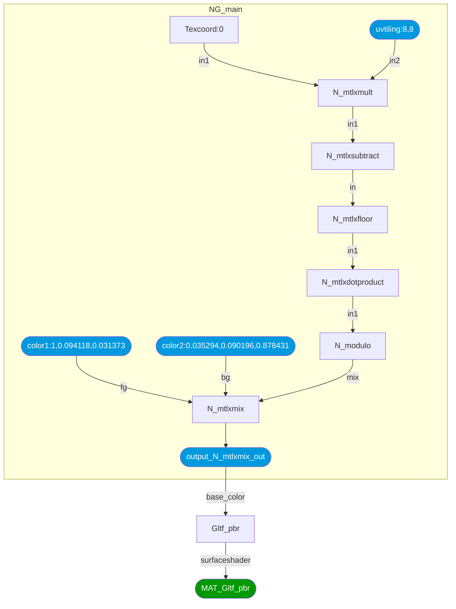
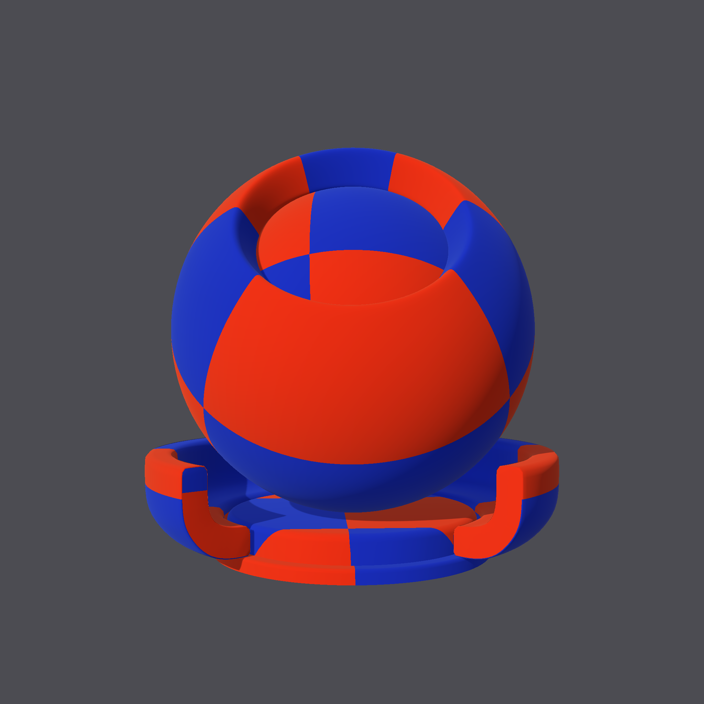

## MaterialX / glTF Procedurals Interop

### Introduction

This package supports the bi-directional translation between MaterialX material graphs and the glTF Procedural Textures extension.

- The Khronos extensions can be found here:
  - <a href="https://github.com/KhronosGroup/glTF/tree/KHR_texture_procedurals/extensions/2.0/Khronos/KHR_texture_procedurals">KHR_texture_procedurals</a>
  - <a href="https://github.com/KhronosGroup/glTF/tree/KHR_texture_procedurals/extensions/2.0/Vendor/EXT_texture_procedurals_mx_1_39">EXT_texture_procedurals_mx_1_39</a>
- The MaterialX specification documents can be found <a href="https://github.com/AcademySoftwareFoundation/MaterialX/tree/main/documents/Specification">here</a>

### Dependencies

- The 1.39 release (or patch releases) of MaterialX available on 
<a href="https://pypi.org/project/MaterialX/">PyPi</a> is required.
- The <code>jsonschema</code> package if Schema validation is desired

### Setup

The Github repository can be forked / cloned locally and the package built using `pip` as follows from the root folder:

`pip install .`

All dependencies listed will be installed if required. 

#### Command Line Interface

Command line documentation forthcoming.

### Documentation

#### API

API documentation forthcoming.

### Unit Tests

Unit test information forthcoming. 

#### Sample Data

The following is some sample data data which shows MaterialX XML document, the corresponding glTF JSON, and a reference rendering using the `MaterialXViewer` sample application which comes as part of the MaterialX distribution.  

<table>
<tr>
<th>Description
<th>Documents
<th>Reference Image

<tr>
<td>The following is a pattern graph that produces a checkerboard pattern. 

The two input colors, and a texture coordinate tiling option are exposed on the node graph. The output is a color which is routed to a downstream glTF PBR shading node (glTF material).

</td>
<td>
<a href="./tests/data/checkerboard_graph.mtlx">MTLX</a>
<a href="./tests/data/checkerboard_graph.gltf">GLTF</a>
</td>
<td>
</td>
</tr>

</table>
