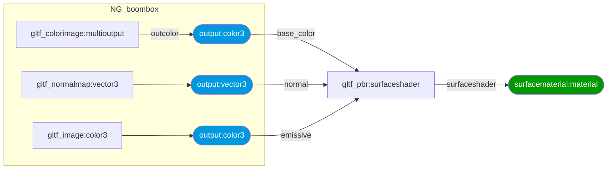

```mermaid
graph LR
    subgraph NG_boombox
    NG_boombox_base_color([output:color3])
    style NG_boombox_base_color  fill:#09D, color:#FFF
    NG_boombox_emission([output:color3])
    style NG_boombox_emission  fill:#09D, color:#FFF
    NG_boombox_normal([output:vector3])
    style NG_boombox_normal  fill:#09D, color:#FFF
    NG_boombox_image_emission1[gltf_image:color3]
    NG_boombox_image_normal1[gltf_normalmap:vector3]
    NG_boombox_image_basecolor1[gltf_colorimage:multioutput]
    end
    SR_boombox[gltf_pbr:surfaceshader]
    Boombox([surfacematerial:material])
    style Boombox   fill:#090, color:#FFF
    NG_boombox_image_basecolor1 --"outcolor"--> NG_boombox_base_color
    NG_boombox_image_emission1 --> NG_boombox_emission
    NG_boombox_image_normal1 --> NG_boombox_normal
    NG_boombox_base_color --"base_color"--> SR_boombox
    NG_boombox_normal --"normal"--> SR_boombox
    NG_boombox_emission --"emissive"--> SR_boombox
    SR_boombox --"surfaceshader"--> Boombox
```
