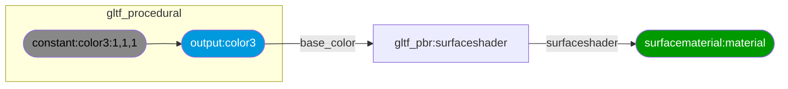
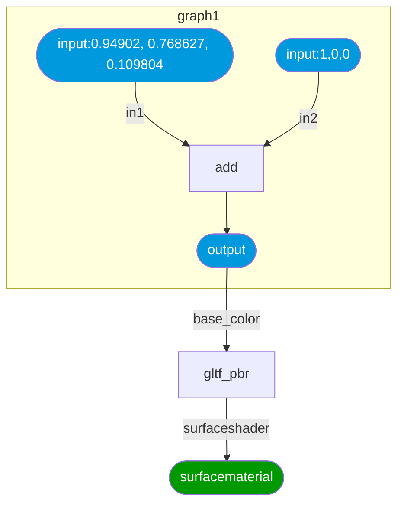
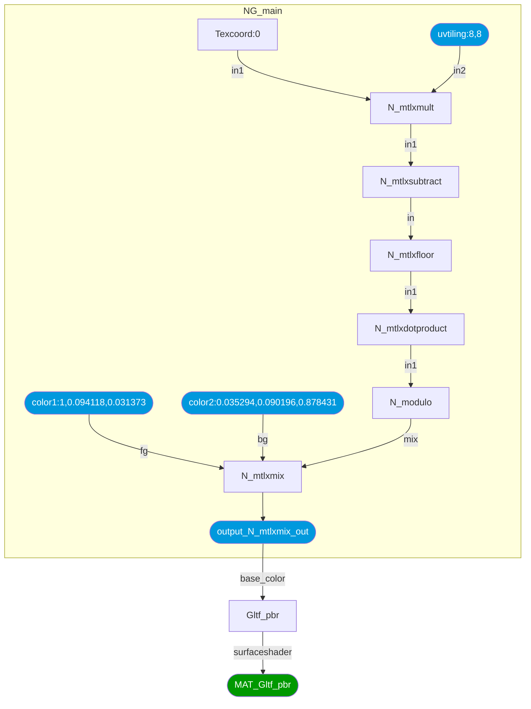

## MaterialX / glTF Procedurals Interop

### Introduction

This package supports the bi-directional translation between MaterialX material graphs and the glTF Procedural Textures extension.

- The Khronos extensions can be found here:
  - <a href="https://github.com/KhronosGroup/glTF/tree/KHR_texture_procedurals/extensions/2.0/Khronos/KHR_texture_procedurals">KHR_texture_procedurals</a>
  - <a href="https://github.com/KhronosGroup/glTF/tree/KHR_texture_procedurals/extensions/2.0/Vendor/EXT_texture_procedurals_mx_1_39">EXT_texture_procedurals_mx_1_39</a>
- The MaterialX specification documents can be found <a href="https://github.com/AcademySoftwareFoundation/MaterialX/tree/main/documents/Specification">here</a>

### Dependencies

- The 1.39 release (or patch releases) of MaterialX available on 
<a href="https://pypi.org/project/MaterialX/">PyPi</a> is required.
- The <code>jsonschema</code> package if Schema validation is desired

### Setup

The Github repository can be forked / cloned locally and the package built using `pip` as follows from the root folder:

`pip install .`

All dependencies listed will be installed if required. 

#### Command Line Interfaces

To convert from a MaterialX document to produce a glTF JSON document the
`materialx_to_gltf.py` utility script may be used.

The following is an example converting a sample file found in the test folder.
The results are saved to a file called `checkerboard_graph.gltf`.

<code>
python source/gltf_materialx_converter/materialx_to_gltf.py "tests/data/checkerboard_graph.mtlx"
</code>

### Documentation

#### API

API documentation can be found <a href="$TOP/documents/html/index.html">here</a>

Documentation can be generated by running `doxygen` from the "documents" folder.

### Tests

The following command can be used to run tests from the root folder:

<code>
python -m unittest discover -s tests -p "test_*.py"
</code>

### Supported MaterialX Configurations

Only specific configurations of MaterialX can be mapped to glTF Texture Procedurals.
1. There must be a `surfacematerial` material node
2. There must be a `glTF PBR` node connected to the surface shader input of the material.
3. A single `nodegraph` with a `color3` output node which is connected to the base color on the surface shader. The constant node can be replaced with the desired set of
nodes, and one or more inputs may be specified to route data into the `nodegraph`. 

Below is a diagram the minimal graph and it's corresponding MaterialX XML document 
from the test data area. There are no inputs specified on the `nodegraph`.

<a href="$TOP//tests/data/minimal_graph.mtlx">Minimal MTLX Configuration File</a>

#### Sample Data

The following is a small set of example files used for unit testing. For each MaterialX file the resulting glTF file is given, along with a diagram of how the graph looks and reference image rendered
using the `MaterialXView` sample application which is available as part of the core MaterialX distribution.

Examples

<table>
<tr>
<th>Description
<th>Documents
<th>Reference Image

<tr>
<td>The following is graph that adds 2 inputs and outputs the results to a glTF PBR shading node.

</td>
<td>
<a href="$TOP//tests/data/add_graph.mtlx">MTLX</a>
<a href="$TOP//tests/data/add_graph.gltf">GLTF</a>
</td>
<td>
</td>
</tr>

<tr>
<td>The following is a pattern graph that produces a checkerboard pattern. 
The two input colors, and a texture coordinate tiling option are exposed on the node graph. The output is a color which is routed to a downstream glTF PBR shading node (glTF material).

</td>
<td>
<a href="$TOP/tests/data/checkerboard_graph.mtlx">MTLX</a>
<a href="$TOP/tests/data/checkerboard_graph.gltf">GLTF</a>
</td>
<td>
</td>
</tr>

</table>

