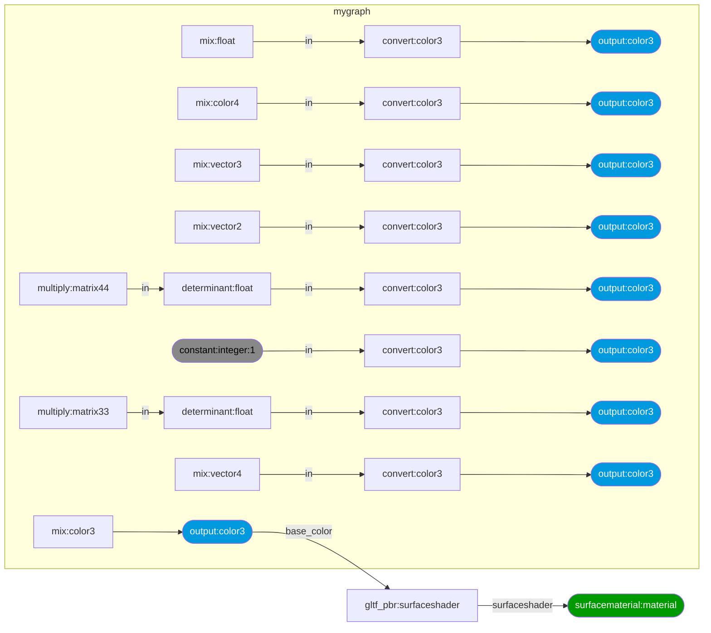

## MaterialX / glTF Procedurals Interop

[](https://github.com/KhronosGroup/glTF-MaterialX-Converter/actions?query=branch%3Amain)

### Introduction

This package supports the bi-directional translation between MaterialX material graphs and the glTF Procedural Textures extension.

- The Khronos extensions can be found here:
  - <a href="https://github.com/KhronosGroup/glTF/tree/KHR_texture_procedurals/extensions/2.0/Khronos/KHR_texture_procedurals">KHR_texture_procedurals</a>
  - <a href="https://github.com/KhronosGroup/glTF/tree/KHR_texture_procedurals/extensions/2.0/Vendor/EXT_texture_procedurals_mx_1_39">EXT_texture_procedurals_mx_1_39</a>
- The MaterialX specification documents can be found <a href="https://github.com/AcademySoftwareFoundation/MaterialX/tree/main/documents/Specification">here</a>

### Dependencies

- The 1.39 release (or patch releases) of MaterialX available on 
<a href="https://pypi.org/project/MaterialX/">PyPi</a> is required.
- The <code>jsonschema</code> package if Schema validation is desired

### Setup

The <a href="https://github.com/KhronosGroup/glTF-MaterialX-Converter/">Github repository</a> can be forked / cloned locally and the package built using `pip` as follows from the root folder:

`pip install .`

All dependencies listed will be installed if required. 

#### Command Line Interfaces

To convert from a MaterialX document to produce a glTF JSON document the
`materialx_to_gltf.py` utility script may be used.

The following is an example converting a sample file found in the test folder.
The results are saved to a file called `checkerboard_graph.gltf`.

<code>
python source/gltf_materialx_converter/materialx_to_gltf.py "tests/data/checkerboard_graph.mtlx"
</code>

#### API Example

The following is a simple example of using the API to convert from MaterialX to glTF

<pre>
# Import support modules
import MaterialX as mx
import json

# Import conversion module utilities
from gltf_materialx_converter import converter as MxGLTFPT
from gltf_materialx_converter import utilities as MxGLTFPTUtil

input_file = "my_file.mtlx" # Replace with desired file name

# Set up definitions and read in a sample file
stdlib, libFiles = MxGLTFPTUtil.load_standard_libraries()
mxdoc = MxGLTFPTUtil.create_working_document([stdlib])
mx.readFromXmlFile(mxdoc, input_file)

# Convert
converter = MxGLTFPT.glTFMaterialXConverter()
json_string, status = converter.materialX_to_glTF(mxdoc)

# Write result to disk
gltf_file = input_file.replace('.mtlx', '.gltf')
with open(gltf_file, 'w') as f:
    f.write(json_string)
</pre>

A sample `Jupyter` notebook is available <a href="https://github.com/KhronosGroup/glTF-MaterialX-Converter/blob/main/documents/notebook.ipynb">here</a>

### Documentation

#### API

API documentation can be found <a href="https://github.khronos.org/glTF-MaterialX-Converter/documents/html/index.html">here</a>

Documentation can be generated by running `doxygen` from the "documents" folder.
It is assumed that `Doxygen` has been installed locally.

### Tests

The following command can be used to run tests from the root folder:

<code>
python -m unittest discover -s tests -p "test_*.py"
</code>

### Supported MaterialX Configurations

Only specific configurations of MaterialX can be mapped to glTF Texture Procedurals.
1. There must be a `surfacematerial` material node
2. There must be a `glTF PBR` node connected to the surface shader input of the material.
3. A single `nodegraph` with a `color3` output node which is connected to the base color on the surface shader. The constant node can be replaced with the desired set of
nodes, and one or more inputs may be specified to route data into the `nodegraph`. 

Any document level qualifiers must be pre-resolved when converting rom MaterialX. This includes any `fileprefix` qualifiers for image file names.

<table>
<tr>
<th>Description
<th>Documents
<th>Reference Image

<tr>
<td> 
A sample minimal graph routing a constant color to the downstream shader.
There are no inputs specified on the `nodegraph`.


</td>
<td>
<a href="https://github.com/KhronosGroup/glTF-MaterialX-Converter/blob/main/tests/data/minimal_graph.mtlx">MTLX</a>
<a href="https://github.com/KhronosGroup/glTF-MaterialX-Converter/blob/main/tests/data/minimal_graph.gltf">GLTF</a>
<a href="https://github.com/KhronosGroup/glTF-MaterialX-Converter/blob/main/tests/data/minimal_graph.usda">USD</a>
</td>
<td>
</td>
</tr>
</table>

#### Test Data

The following is a set of example files used for unit testing. The term "Compound nodes" refers to nodes
which are implemented as node graphs themselves ("functional graphs" in MaterialX terminology)

For each `MaterialX` file the resulting `glTF` file is given, along with a diagram of how the graph looks and reference image.
A sample conversion from MaterialX to `USDShade` network is provided where applicable.

<details open><summary>Examples</summary>

<table>
<tr>
<th>Description
<th>Documents
<th>Reference Image

<tr>
<td> 
The following is a simple graph which adds two colors together.

- Graph count: single
- Graph inputs: multiple
- Graph outputs: single
- Stream inputs: no
- Compound nodes: none
- Downstream shader: glTF PBR


</td>
<td>
<a href="https://github.com/KhronosGroup/glTF-MaterialX-Converter/blob/main/tests/data/add_graph.mtlx">MTLX</a>
<a href="https://github.com/KhronosGroup/glTF-MaterialX-Converter/blob/main/tests/data/add_graph.gltf">GLTF</a>
<a href="https://github.com/KhronosGroup/glTF-MaterialX-Converter/blob/main/tests/data/add_graph.usda">USD</a>
</td>
<td>
</td>
</tr>

<tr>
<td>

The following is a pattern graph that produces a checkerboard pattern. 
The two input colors, and a texture coordinate tiling option are exposed on the node graph. The output is a color which is routed to a downstream glTF PBR shading node (glTF material).

- Graph count: single
- Graph inputs: multiple
- Graph outputs: single
- Stream inputs: yes
- Compound nodes: none
- Downstream shader: glTF PBR


</td>
<td>
<a href="https://github.com/KhronosGroup/glTF-MaterialX-Converter/blob/main/tests/data/checkerboard_graph.mtlx">MTLX</a>
<a href="https://github.com/KhronosGroup/glTF-MaterialX-Converter/blob/main/tests/data/checkerboard_graph.gltf">GLTF</a>
<a href="https://github.com/KhronosGroup/glTF-MaterialX-Converter/blob/main/tests/data/checkerboard_graph.usda">USD</a>
</td>
<td>
</td>
</tr>

<tr>
<td>Pattern graph only without any materials.

- Graph count: single
- Graph inputs: multiple
- Graph outputs: single
- Stream inputs: no
- Compound nodes: yes
- Downstream shader: none


</td>
<td><a href="https://github.com/KhronosGroup/glTF-MaterialX-Converter/blob/main/tests/data/no_material.mtlx">MTLX</a>
<a href="https://github.com/KhronosGroup/glTF-MaterialX-Converter/blob/main/tests/data/no_material.gltf">GLTF</a>
<td>
</tr>

<tr>
<td>
Pattern connected to an unsupported (non-glTF) PBR downstream shader.

- Graph count: single
- Graph inputs: multiple
- Graph outputs: single
- Stream inputs: no
- Compound nodes: yes
- Downstream shader: "standard surface"


</td>
<td><a href="https://github.com/KhronosGroup/glTF-MaterialX-Converter/blob/main/tests/data/unsupported_stdsurf.mtlx">MTLX</a>
<a href="https://github.com/KhronosGroup/glTF-MaterialX-Converter/blob/main/tests/data/unsupported_stdsurf.gltf">GLTF</a>
<a href="https://github.com/KhronosGroup/glTF-MaterialX-Converter/blob/main/tests/data/unsupported_stdsurf.usda">USD</a>
</td>
<td> (original)
 (skipping material )
</td>

<tr>
<td>Pattern graph using a file texture

- Graph count: single
- Graph inputs: none
- Graph outputs: single
- Stream inputs: yes
- File inputs: single. Non-default filtering.
- Compound nodes: yes. UV placement.
- Downstream shader: gltf PBR


</td>
<td><a href="https://github.com/KhronosGroup/glTF-MaterialX-Converter/blob/main/tests/data/bindings/gltf_simple_filetexture.mtlx">MTLX</a>
<a href="https://github.com/KhronosGroup/glTF-MaterialX-Converter/blob/main/tests/data/bindings/gltf_simple_filetexture.gltf">GLTF</a>
<a href="https://github.com/KhronosGroup/glTF-MaterialX-Converter/blob/main/tests/data/bindings/gltf_simple_filetexture.usda">USD</a>
<td>
</tr>

<tr>
<td>Pattern graph using using multiple file textures with different texture placements and a shared input stream.

- Graph count: single
- Graph inputs: none
- Graph outputs: single
- Stream inputs: yes 
- File inputs: multiple 
- Compound nodes: yes.
- Downstream shader: gltf PBR


</td>
<td><a href="https://github.com/KhronosGroup/glTF-MaterialX-Converter/blob/main/tests/data/bindings/gltf_shared_filetexture.mtlx">MTLX</a>
<a href="https://github.com/KhronosGroup/glTF-MaterialX-Converter/blob/main/tests/data/bindings/gltf_shared_filetexture.gltf">GLTF</a>
<a href="https://github.com/KhronosGroup/glTF-MaterialX-Converter/blob/main/tests/data/bindings/gltf_shared_filetexture.usda">USD</a>
<td>
</tr>

<tr>
<td>Pattern graph using using multiple file textures routed to different outputs. Each output
is connected to a different downstream shader.

- Graph count: single
- Graph inputs: none
- Graph outputs: single
- Stream inputs: yes 
- File inputs: yes. 
- Compound nodes: yes.
- Downstream shader: gltf PBR


</td>
<td><a href="https://github.com/KhronosGroup/glTF-MaterialX-Converter/blob/main/tests/data/bindings/gltf_shared_filetexture_2.mtlx">MTLX</a>
<a href="https://github.com/KhronosGroup/glTF-MaterialX-Converter/blob/main/tests/data/bindings/gltf_shared_filetexture_2.gltf">GLTF</a>
<a href="https://github.com/KhronosGroup/glTF-MaterialX-Converter/blob/main/tests/data/bindings/gltf_shared_filetexture_2.usda">USD</a>
<td>
</tr>

<tr>
<td>Example MaterialX version of "boombox" example (from Khronos sample assets) that shows file name resolving.

- Graph count: single
- Graph inputs: none
- Graph outputs: one
- File inputs: yes. 
- File prefix: resolved during conversion (as is done for "UsdMtlx" resolve)
- Compound nodes: no
- Downstream shader: glTF PBR


</td>
<td><a href="https://github.com/KhronosGroup/glTF-MaterialX-Converter/blob/main/tests/data/gltf_examples/gltf_pbr_boombox.mtlx">MTLX</a>
<a href="https://github.com/KhronosGroup/glTF-MaterialX-Converter/blob/main/tests/data/gltf_examples/gltf_pbr_boombox.gltf">GLTF</a>
<a href="https://github.com/KhronosGroup/glTF-MaterialX-Converter/blob/main/tests/data/gltf_examples/gltf_pbr_boombox.usda">USD</a>
</td>
<td>
</td>
</tr>

<tr>
<td>Example with various port data types: integer, vec2, vec3, vec4, color3, color4, integer, matrix33, matrix44

- Graph count: single
- Graph inputs: none
- Graph outputs: 1 per type
- File inputs: no
- Compound nodes: no
- Downstream shader: glTF PBR



</td>
<td><a href="https://github.com/KhronosGroup/glTF-MaterialX-Converter/blob/main/tests/data/supported_types.mtlx">MTLX</a>
<a href="https://github.com/KhronosGroup/glTF-MaterialX-Converter/blob/main/tests/data/supported_types.gltf">GLTF</a>
<!-- <a href="https://github.com/KhronosGroup/glTF-MaterialX-Converter/blob/main/tests/data/supported_types.usda">USD</a> -->
</td>
<td>
</td>
</tr>

</table>

</details>

### Development Information

<details><summary><h4>Reference Rendering</h4></summary>

All reference images are rendered using the `MaterialXView` sample application which is available as part of  
<a href="https://github.com/AcademySoftwareFoundation/MaterialX/releases">MaterialX releases</a>. The release
version used matches the version requirement for this package.

A sample utility called `test_render` is provided which will scan all files MaterialX XML files in a given folder hierarchy and use the path to `MaterialXView` to
render into the same folder.

Example:

```
python utilities/test_render.py tests/data -r 512 -c <path to MaterialXView>
```
where `<path to MaterialXView>` is the path to the MaterialXView executable with
a the resolution set to 512 by 512.

</details>

<details><summary><h4>Build Scripts</h4></summary>

Sample build scripts are provided in the `utilities` folder as follows:

1. `build.sh` : Will pull from head of the repo, install dependencies, and build the package.
2. `build_docs.sh` : Will build only the documentation. Called from `build.sh`. Doxygen is assumed to be installed. The README files are generated from the template Markdown file: `utilitites/README_template.md.` This will install the top level as well as the API documentation versions of this file with appropriate formatting to support the `Mermaid` graphs used to node graph diagrams.
3. `build_tests.sh` : Will run unit tests as well as command line tests.

`build.sh` is called within the check-in workflow defined in `.github/workflows/main.yml`

</details>

